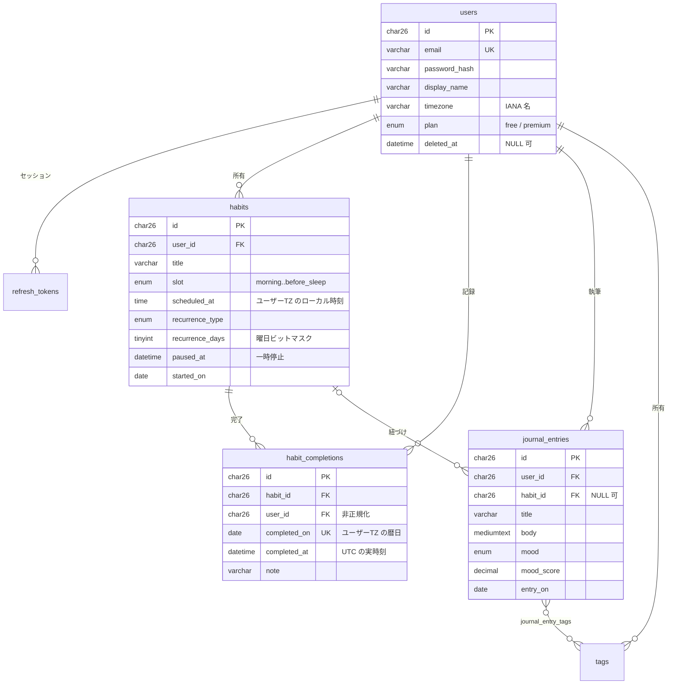
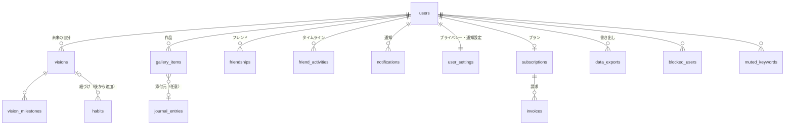

# DB スキーマ設計

> **ステータス: MVP コアは確定、それ以外は俯瞰のみ（2026-08-09）。**
> DBMS は MySQL 8.0（`docs/api-contract.md` §5-3 で決定）。
> アクセスは `database/sql` + `go-sql-driver/mysql` に手書き SQL、
> マイグレーションは golang-migrate の `.sql`。レイヤ構成は `.claude/skills/backend-conventions`。

このドキュメントは 2 層構成になっている。

- **§4 全体像** … 未実装ドメインも含めた俯瞰。テーブルの存在と関連だけを示す
- **§5 MVP コアのテーブル定義** … 実際に `backend/migrations/` に入れる 7 テーブル

## 1. 設計の前提

永続化の対象は `frontend/apps/web/src/lib/api/` のモックから逆算した。
ただし**モックの型をそのままテーブルにはしない**。`docs/api-contract.md` §1 のとおり
モックには表示用に整形済みの文字列が多数含まれており、それらはデータではないため。

| モックの値 | DB での扱い |
| --- | --- |
| `Habit.meta` = `"完了済 · 7:15"` | 持たない。`habit_completions` の有無と `completed_at` から組み立てる |
| `JournalEntry.dateLabel` = `"4/22"` | 持たない。`entry_on` から算出 |
| `JournalEntry.moodColor` = `"#8b6f47"` | 持たない。`mood` の enum 値からフロントの辞書で引く |
| `JournalEntry.excerpt` | 持たない。`body` の先頭から生成 |
| `JournalEntry.stats` = `["習慣 4/5 達成", ...]` | 持たない。その日の集計クエリの結果 |
| `HabitDetail.startedDaysAgo` = `172` | 持たない。`habits.started_on` との差分 |
| `StreakSummary.current` / `longest` | 持たない。`habit_completions` から算出（§6） |

**原則: 導出できる値はカラムにしない。** 非正規化はクエリが実測で遅いと分かってから入れる。
例外は `habit_completions.user_id`（理由は §5.4）。

## 2. 全テーブルに効く 5 つの決定

### 2.1 主キーは ULID（`CHAR(26)`）

```sql
id CHAR(26) CHARACTER SET ascii COLLATE ascii_bin NOT NULL
```

- InnoDB の主キーはクラスタインデックスなので、**挿入順がランダムだとページ分割が多発する**。
  UUIDv4 はこれに該当する。ULID は先頭 48bit がミリ秒精度のタイムスタンプで単調増加するため、
  常に B+ツリーの右端に追記される
- `BIGINT AUTO_INCREMENT` にしなかったのは、ID を URL やレスポンスに出す以上、
  総ユーザー数・総習慣数が推測でき、他人の ID を列挙できてしまうため
- `BINARY(16)` の UUIDv7 でも性能は同等だが、手書き SQL を直接叩く運用では
  毎回 `HEX()` が要る。26 バイトの差より可読性を取った
- `ascii` 指定は必須。省略すると `utf8mb4` になり 1 カラム 104 バイトを占める
- `ascii_bin` は大文字小文字を区別する。ULID は Crockford Base32 の**大文字**で生成し、
  アプリ側で正規化してから DB に渡す

生成は Go 側（`github.com/oklog/ulid/v2`）で行う。DB のデフォルト値では作らない。

### 2.2 日時は `DATETIME(3)` に UTC、DB のデフォルト値は使わない

```sql
created_at DATETIME(3) NOT NULL,     -- DEFAULT CURRENT_TIMESTAMP(3) は付けない
```

- `TIMESTAMP` を使わないのは backend-conventions のとおり（サーバの `time_zone` 設定に依存する）
- **`DEFAULT CURRENT_TIMESTAMP(3)` も同じ理由で使わない。** `CURRENT_TIMESTAMP` はセッションの
  `time_zone` で評価されるため、DSN に `time_zone` を指定し忘れたクライアントが INSERT すると
  JST の値が UTC のつもりで入る。**しかもエラーにならない**ので発覚が遅れる。
  アプリから常に UTC の値を明示的に渡せばこの事故は起きない
- 保険として DSN 側でも `time_zone='+00:00'` を指定する（§8）

| 用途 | 型 | 例 |
| --- | --- | --- |
| 実時刻（UTC） | `DATETIME(3)` | `2026-04-22T07:15:00.000Z` |
| ユーザーTZ での暦日 | `DATE` | `2026-04-22` |
| ユーザーTZ での時刻（習慣の予定時刻など） | `TIME` | `07:00:00` |

カラム名は実時刻が `_at`、暦日が `_on` で揃える（`completed_at` / `completed_on`）。

### 2.3 「今日」はユーザーのタイムゾーンで決める

`users.timezone` に IANA 名（`Asia/Tokyo`）を保存し、サーバがそれで暦日を判定する。

- `docs/api-contract.md` §2 で `X-Timezone` ヘッダ案と併記されていた論点。
  **ヘッダ方式は採らない。** 出張中のノート PC と自宅のスマホで同じ日の記録が
  別の日に落ちるため。「連続 12 日」が端末によって変わるのは致命的
- 深夜 2 時の記録を前日扱いにする「1 日の始まり」オフセットは MVP では持たない。
  必要になったら `users.day_start_offset_minutes` を足す（後方互換で追加できる）
- **週の起点は月曜に固定**（ISO 8601）。`StreakSummary.week: boolean[]` が
  週の起点を型から読み取れない問題（api-contract §1）への回答。
  `recurrence_days` のビット順もこれに揃える

### 2.4 削除は論理削除（`deleted_at`）

ヘルプ FAQ に「削除から 30 日間はゴミ箱に残っています」と書かれている
（`frontend/apps/web/src/lib/api/settings.ts`）。物理削除では実現できない。

- `deleted_at DATETIME(3) NULL` を持つのは **`users` / `habits` / `journal_entries`**。
  ユーザーが「消した」と認識するリソースだけ
- `habit_completions` は物理削除。チェックを外す操作は「取り消し」であってゴミ箱行きではない
- `refresh_tokens` は失効（`revoked_at`）で表現し、期限切れは物理削除でよい
- **論理削除とユニーク制約は衝突する。** `users.email` に `UNIQUE` を張ると、
  退会したユーザーの行が残っている限り同じメールで再登録できない。
  `UNIQUE (email, deleted_at)` は解決にならない（MySQL の UNIQUE は NULL の重複を許すため、
  生存行同士の重複を弾けなくなる）。**退会時に email をアノニマイズする**方針を採る
  （`deleted+<ulid>@invalid.selfsketch` に置換）

### 2.5 列挙値は `ENUM`、値は snake_case

- API の enum 規約（`before_sleep` / `paid`）と同じ文字列を DB にもそのまま入れる。
  変換表をアプリに持たないので、SQL を直接見たときに意味が読める
- `VARCHAR` + アプリ側バリデーションにしなかったのは、手書き SQL で複数箇所から
  INSERT する構成では DB 側にも制約を置いたほうが安全なため
- 値の**末尾への追加**は MySQL 8.0 では INSTANT DDL でテーブル再構築なしに通る。
  途中への挿入・削除・リネームは再構築が要るので、順序に意味を持たせない

## 3. 命名規約

| 対象 | 規則 | 例 |
| --- | --- | --- |
| テーブル | 複数形 snake_case | `habit_completions` |
| カラム | snake_case | `completed_on` |
| 主キー | 常に `id` | `id` |
| 外部キー | `<参照先の単数形>_id` | `habit_id` |
| 真偽値 | `is_` / `has_` 接頭辞、`TINYINT(1)` | `is_favorite` |
| 実時刻 | `_at`（`DATETIME(3)` UTC） | `created_at` |
| 暦日 | `_on`（`DATE`） | `entry_on` |
| ユニーク制約 | `uq_<table>_<cols>` | `uq_habit_completions_habit_date` |
| 索引 | `idx_<table>_<cols>` | `idx_journal_entries_user_date` |
| 外部キー制約 | `fk_<table>_<参照先>` | `fk_habits_user` |

テーブルオプションは全テーブル共通。

```sql
ENGINE = InnoDB DEFAULT CHARSET = utf8mb4 COLLATE = utf8mb4_0900_ai_ci
```

## 4. 全体像

MVP で作るのは実線の 7 テーブル。破線は未実装ドメイン（§7）。



未実装ドメインを含めた俯瞰。`users` から伸びる主要な枝だけを示す。



## 5. MVP コアのテーブル定義

### 5.1 `users`

```sql
CREATE TABLE users (
  id                CHAR(26) CHARACTER SET ascii COLLATE ascii_bin NOT NULL,
  email             VARCHAR(255) CHARACTER SET ascii COLLATE ascii_general_ci NOT NULL,
  password_hash     VARCHAR(255) CHARACTER SET ascii COLLATE ascii_bin NOT NULL,
  display_name      VARCHAR(64) NOT NULL,
  timezone          VARCHAR(64) CHARACTER SET ascii COLLATE ascii_general_ci NOT NULL DEFAULT 'Asia/Tokyo',
  plan              ENUM('free', 'premium') NOT NULL DEFAULT 'free',
  email_verified_at DATETIME(3) NULL,
  created_at        DATETIME(3) NOT NULL,
  updated_at        DATETIME(3) NOT NULL,
  deleted_at        DATETIME(3) NULL,
  PRIMARY KEY (id),
  UNIQUE KEY uq_users_email (email)
) ENGINE = InnoDB DEFAULT CHARSET = utf8mb4 COLLATE = utf8mb4_0900_ai_ci;
```

- `email` は `ascii_general_ci`。国際化ドメインは punycode で来るので ASCII で足りる。
  `_ci` にしているのは大文字小文字違いでの重複登録を DB で弾くため。
  アプリ側でも小文字に正規化してから保存する
- `password_hash` は bcrypt（60 文字）または argon2id（~100 文字）。
  `VARCHAR(255)` はアルゴリズム変更の余地。**ハッシュ関数は後で決める**
- `plan` は Free 3 習慣 / Premium 無制限の制限判定に使う（`settings.ts` の `PREMIUM_PLANS`）。
  課金の実体（`subscriptions` / `invoices`）は未実装なので、いまは users の列で持つ
- `timezone` は §2.3 のとおり。値の妥当性（`time.LoadLocation` が通るか）はアプリで検証する

### 5.2 `refresh_tokens`

認証は JWT（`docs/api-contract.md` §3 案 B）。アクセストークンはステートレスなので DB に持たず、
**リフレッシュトークンだけを永続化**する。

```sql
CREATE TABLE refresh_tokens (
  id           CHAR(26) CHARACTER SET ascii COLLATE ascii_bin NOT NULL,
  user_id      CHAR(26) CHARACTER SET ascii COLLATE ascii_bin NOT NULL,
  token_hash   CHAR(64) CHARACTER SET ascii COLLATE ascii_bin NOT NULL,
  rotated_from CHAR(26) CHARACTER SET ascii COLLATE ascii_bin NULL,
  user_agent   VARCHAR(255) NULL,
  expires_at   DATETIME(3) NOT NULL,
  revoked_at   DATETIME(3) NULL,
  created_at   DATETIME(3) NOT NULL,
  PRIMARY KEY (id),
  UNIQUE KEY uq_refresh_tokens_token_hash (token_hash),
  KEY idx_refresh_tokens_user_expires (user_id, expires_at),
  CONSTRAINT fk_refresh_tokens_user FOREIGN KEY (user_id) REFERENCES users (id) ON DELETE CASCADE
) ENGINE = InnoDB DEFAULT CHARSET = utf8mb4 COLLATE = utf8mb4_0900_ai_ci;
```

- **トークンそのものは保存しない。** SHA-256 の hex（64 文字）を保存し、照合はハッシュで行う。
  DB が漏れてもトークンを再利用されないため。パスワードと違い高速なハッシュでよい
  （トークンは十分な長さのランダム値で、辞書攻撃が成立しない）
- `rotated_from` はローテーション元の行 ID。使用済みトークンが再び提示されたら
  **盗まれたと判断してその系列を全失効させる**ための追跡用（refresh token rotation の定石）
- `user_agent` は「ログイン中の端末」表示用。IP は保存しない（個人情報を増やさない）
- 期限切れ行は定期ジョブで物理削除する。論理削除しても価値がない

### 5.3 `habits`

```sql
CREATE TABLE habits (
  id               CHAR(26) CHARACTER SET ascii COLLATE ascii_bin NOT NULL,
  user_id          CHAR(26) CHARACTER SET ascii COLLATE ascii_bin NOT NULL,
  title            VARCHAR(128) NOT NULL,
  slot             ENUM('morning', 'after_wake', 'noon', 'afternoon', 'night', 'before_sleep') NOT NULL,
  scheduled_at     TIME NULL,
  duration_minutes SMALLINT UNSIGNED NULL,
  recurrence_type  ENUM('daily', 'weekdays', 'weekly', 'custom') NOT NULL DEFAULT 'daily',
  recurrence_days  TINYINT UNSIGNED NOT NULL DEFAULT 127,
  weekly_target    TINYINT UNSIGNED NULL,
  sort_order       INT NOT NULL DEFAULT 0,
  started_on       DATE NOT NULL,
  paused_at        DATETIME(3) NULL,
  created_at       DATETIME(3) NOT NULL,
  updated_at       DATETIME(3) NOT NULL,
  deleted_at       DATETIME(3) NULL,
  PRIMARY KEY (id),
  KEY idx_habits_user_sort (user_id, deleted_at, sort_order),
  CONSTRAINT fk_habits_user FOREIGN KEY (user_id) REFERENCES users (id) ON DELETE CASCADE
) ENGINE = InnoDB DEFAULT CHARSET = utf8mb4 COLLATE = utf8mb4_0900_ai_ci;
```

**`slot` と `recurrence_type` は別の軸。** モックでは `HabitSlot`（`"毎朝" | "起床後" | ...`）と
`HABIT_SLOT_OPTIONS`（`"毎日" | "平日のみ" | "週3回" | "カスタム"`）が同じ「スロット」の名前で
別物として存在している。前者は**時間帯**、後者は**頻度**なので分けた。

| `recurrence_type` | `recurrence_days` | `weekly_target` | 意味 |
| --- | --- | --- | --- |
| `daily` | `127`（全ビット） | `NULL` | 毎日 |
| `weekdays` | `31`（月〜金） | `NULL` | 平日のみ |
| `weekly` | 参照しない | `3` | 週 3 回（曜日は問わない） |
| `custom` | 任意 | `NULL` | 曜日指定 |

`recurrence_days` は曜日ビットマスク。**bit0 = 月曜、bit6 = 日曜**（§2.3 の週起点に合わせる）。
`JSON` 配列や別テーブルにしなかったのは、7 個固定の集合であり、
`recurrence_days & (1 << ?)` で索引を使わない絞り込みが済むため。

- `scheduled_at` は `TIME`（`DATETIME` ではない）。「毎朝 7:00」はユーザーの生活時間であって
  絶対時刻ではない。UTC に変換して保存すると、ユーザーが引っ越して `timezone` を変えたときに
  予定が 7:00 からずれる
- `paused_at`（一時停止）と `deleted_at`（削除）は別概念。一時停止中の習慣は
  一覧に残るが「今日」の対象から外れ、ストリークの分母にも入らない
- `vision_id`（未来の自分への紐づけ、`HabitDetail.linkedVision`）は **MVP では作らない**。
  参照先の `visions` がまだ無いため。`visions` を足すときに `ALTER TABLE` で追加する
- `idx_habits_user_sort` に `deleted_at` を挟んでいるのは、一覧が常に
  `WHERE user_id = ? AND deleted_at IS NULL ORDER BY sort_order` で引かれるため

### 5.4 `habit_completions`

```sql
CREATE TABLE habit_completions (
  id           CHAR(26) CHARACTER SET ascii COLLATE ascii_bin NOT NULL,
  habit_id     CHAR(26) CHARACTER SET ascii COLLATE ascii_bin NOT NULL,
  user_id      CHAR(26) CHARACTER SET ascii COLLATE ascii_bin NOT NULL,
  completed_on DATE NOT NULL,
  completed_at DATETIME(3) NOT NULL,
  note         VARCHAR(500) NULL,
  created_at   DATETIME(3) NOT NULL,
  PRIMARY KEY (id),
  UNIQUE KEY uq_habit_completions_habit_date (habit_id, completed_on),
  KEY idx_habit_completions_user_date (user_id, completed_on),
  CONSTRAINT fk_habit_completions_habit FOREIGN KEY (habit_id) REFERENCES habits (id) ON DELETE CASCADE,
  CONSTRAINT fk_habit_completions_user FOREIGN KEY (user_id) REFERENCES users (id) ON DELETE CASCADE
) ENGINE = InnoDB DEFAULT CHARSET = utf8mb4 COLLATE = utf8mb4_0900_ai_ci;
```

- **`uq_habit_completions_habit_date` がこのテーブルの肝。**
  `POST /habits/:id/completions` は楽観更新から呼ばれ、通信の再送で二重に飛びうる。
  アプリ側のチェックでは競合状態を防げないので、DB の制約で弾いて
  重複エラーを冪等な成功として扱う
- `completed_on`（ユーザーTZ の暦日）と `completed_at`（UTC の実時刻）を**両方持つ**。
  前者はストリーク計算とユニーク制約、後者は「完了済 · 7:15」の表示と時間帯分析
  （`InsightsData.hourly`）に要る。`completed_at` から `completed_on` を毎回導出することもできるが、
  そのためには全行にユーザーの TZ 変換をかける必要があり、索引が効かなくなる
- **`user_id` はここだけ意図的に非正規化している。** 年間ヒートマップ（`StreakPage.yearHeatmap`、
  365 日 × 全習慣）とユーザー単位のストリークは「そのユーザーの全完了記録」を日付範囲で引く。
  `habits` との JOIN が要らなくなり、`idx_habit_completions_user_date` だけで完結する。
  整合性は `habit_id` 側の `ON DELETE CASCADE` と、アプリでの一括書き込みで保つ
- `note` は `HabitDetail.notes`（その日の一言）。ジャーナル本文とは別物なのでここに置く

### 5.5 `journal_entries`

```sql
CREATE TABLE journal_entries (
  id          CHAR(26) CHARACTER SET ascii COLLATE ascii_bin NOT NULL,
  user_id     CHAR(26) CHARACTER SET ascii COLLATE ascii_bin NOT NULL,
  habit_id    CHAR(26) CHARACTER SET ascii COLLATE ascii_bin NULL,
  title       VARCHAR(128) NOT NULL,
  body        MEDIUMTEXT NOT NULL,
  mood        ENUM('calm', 'bright', 'positive', 'sleepy', 'stagnant') NULL,
  mood_score  DECIMAL(2, 1) NULL,
  quote       VARCHAR(255) NULL,
  is_favorite TINYINT(1) NOT NULL DEFAULT 0,
  entry_on    DATE NOT NULL,
  written_at  DATETIME(3) NOT NULL,
  created_at  DATETIME(3) NOT NULL,
  updated_at  DATETIME(3) NOT NULL,
  deleted_at  DATETIME(3) NULL,
  PRIMARY KEY (id),
  KEY idx_journal_entries_user_date (user_id, deleted_at, entry_on),
  KEY idx_journal_entries_habit (habit_id),
  CONSTRAINT fk_journal_entries_user FOREIGN KEY (user_id) REFERENCES users (id) ON DELETE CASCADE,
  CONSTRAINT fk_journal_entries_habit FOREIGN KEY (habit_id) REFERENCES habits (id) ON DELETE SET NULL
) ENGINE = InnoDB DEFAULT CHARSET = utf8mb4 COLLATE = utf8mb4_0900_ai_ci;
```

- `body` は `MEDIUMTEXT` に**プレーンテキストで 1 本**。モックの `body: string[]`（段落配列）は
  空行区切りで表現し、配列化はフロントで行う。段落を行テーブルに分けると
  並び順の管理コストに見合わない
- `mood` の enum 値はモックの日本語（穏やか / 明るい / 前向き / 眠い / 停滞）に対応する。
  `moodColor` は持たない（§1）
- `habit_id` は `ON DELETE SET NULL`。習慣を消してもジャーナルは残す。
  ただし `habits` は論理削除が主なので、この FK が発火するのは物理削除時だけ
- 本文の全文検索は MVP では入れない。必要になったら `FULLTEXT` インデックスを
  ngram パーサ付きで足す（日本語は `WITH PARSER ngram` が要る）

### 5.6 `tags` / `journal_entry_tags`

```sql
CREATE TABLE tags (
  id         CHAR(26) CHARACTER SET ascii COLLATE ascii_bin NOT NULL,
  user_id    CHAR(26) CHARACTER SET ascii COLLATE ascii_bin NOT NULL,
  name       VARCHAR(64) NOT NULL,
  created_at DATETIME(3) NOT NULL,
  PRIMARY KEY (id),
  UNIQUE KEY uq_tags_user_name (user_id, name),
  CONSTRAINT fk_tags_user FOREIGN KEY (user_id) REFERENCES users (id) ON DELETE CASCADE
) ENGINE = InnoDB DEFAULT CHARSET = utf8mb4 COLLATE = utf8mb4_0900_ai_ci;

CREATE TABLE journal_entry_tags (
  journal_entry_id CHAR(26) CHARACTER SET ascii COLLATE ascii_bin NOT NULL,
  tag_id           CHAR(26) CHARACTER SET ascii COLLATE ascii_bin NOT NULL,
  created_at       DATETIME(3) NOT NULL,
  PRIMARY KEY (journal_entry_id, tag_id),
  KEY idx_journal_entry_tags_tag (tag_id),
  CONSTRAINT fk_journal_entry_tags_entry FOREIGN KEY (journal_entry_id) REFERENCES journal_entries (id) ON DELETE CASCADE,
  CONSTRAINT fk_journal_entry_tags_tag FOREIGN KEY (tag_id) REFERENCES tags (id) ON DELETE CASCADE
) ENGINE = InnoDB DEFAULT CHARSET = utf8mb4 COLLATE = utf8mb4_0900_ai_ci;
```

- タグは**ユーザーごとに名前空間を分ける**（`uq_tags_user_name`）。
  `#継続14日目` のような個人的なタグを全ユーザーで共有する意味がない
- `name` に `#` は含めない。表示時に付ける
- `journal_entries.tags` を JSON カラムにする案もあるが、
  「タグで絞り込む」「よく使うタグを出す」が索引で引けなくなるため中間テーブルにした
- 中間テーブルの主キーは複合キー。ULID の `id` は持たせない（行を個別に指す必要がない）

## 6. 主要クエリと索引の対応

### 今日のダッシュボード（`GET /api/v1/dashboard/today`）

```sql
-- 今日やる習慣（?date はユーザーTZ で算出した暦日、?dow は 0=月 の曜日番号）
SELECT h.id, h.title, h.slot, h.scheduled_at, c.completed_at
FROM habits h
LEFT JOIN habit_completions c ON c.habit_id = h.id AND c.completed_on = ?
WHERE h.user_id = ? AND h.deleted_at IS NULL AND h.paused_at IS NULL
  AND (h.recurrence_type = 'weekly' OR h.recurrence_days & (1 << ?) <> 0)
ORDER BY h.sort_order;
```

`idx_habits_user_sort` が `WHERE` と `ORDER BY` の両方をカバーする。
`recurrence_days` のビット演算は索引を使えないが、1 ユーザーの習慣は多くて数十件なので問題ない。

### ストリーク（`current` / `longest`）

日次の達成有無を出してから、ギャップ&アイランド法で連続区間を数える。

```sql
WITH done_days AS (
  SELECT DISTINCT completed_on FROM habit_completions
  WHERE user_id = ? AND completed_on BETWEEN ? AND ?
),
islands AS (
  SELECT completed_on,
         completed_on - INTERVAL ROW_NUMBER() OVER (ORDER BY completed_on) DAY AS grp
  FROM done_days
)
SELECT MIN(completed_on) AS from_on, MAX(completed_on) AS to_on, COUNT(*) AS length
FROM islands GROUP BY grp ORDER BY from_on DESC;
```

`idx_habit_completions_user_date` が範囲走査をカバーする。
**結果をキャッシュするカラムは持たない。** 数年分でも数千行で、計算は 1ms のオーダー。
遅くなってから `user_streaks` テーブルを足す。

### 年間ヒートマップ（`StreakPage.yearHeatmap`）

```sql
SELECT completed_on, COUNT(*) AS cnt
FROM habit_completions
WHERE user_id = ? AND completed_on BETWEEN ? AND ?
GROUP BY completed_on;
```

`user_id` を非正規化した最大の理由（§5.4）。JOIN なしで索引だけで完結する。

## 7. 未実装ドメインのメモ

DDL は書かないが、MVP のスキーマが将来これらを受け入れられるかは確認してある。

| ドメイン | テーブル案 | 既存スキーマへの影響 |
| --- | --- | --- |
| 未来の自分 | `visions` / `vision_milestones` | `habits` に `vision_id` を `ALTER` で追加 |
| ギャラリー | `gallery_items` | 画像実体は外部ストレージ、DB は URL とメタのみ。保存先は未決 |
| フレンド | `friendships`（`requester_id` / `addressee_id` の対称管理）/ `friend_activities` | 影響なし |
| 通知 | `notifications` | 影響なし |
| 設定 | `user_settings`（`users` と 1:1）/ `blocked_users` / `muted_keywords` | プライバシー設定は列が 10 個あるので `users` に混ぜず別テーブル |
| 課金 | `subscriptions` / `invoices` | `users.plan` は `subscriptions` 導入時に導出値へ移す |
| 書き出し | `data_exports` | 影響なし |

`analysis/` が本体 DB を参照するのか別系統かは未決（`docs/api-contract.md` §5-6）。
参照する場合はリードレプリカを想定し、書き込みはしない。

## 8. マイグレーション運用

`backend/migrations/` に golang-migrate 形式で置く。実行手順は `backend/README.md`。

```
0001_create_users.up.sql / .down.sql
0002_create_refresh_tokens.up.sql / .down.sql
0003_create_habits.up.sql / .down.sql
0004_create_habit_completions.up.sql / .down.sql
0005_create_journal_entries.up.sql / .down.sql
0006_create_tags.up.sql / .down.sql
0007_create_journal_entry_tags.up.sql / .down.sql
```

- 番号は 4 桁連番。外部キーの参照先が先に来るよう順序を固定する
- **`.down.sql` を必ず書く。** 書けない変更（列の削除でデータが失われる等）は
  「新列を足す」「読み替える」「旧列を消す」の 3 段に分ける
- **1 マイグレーション = 1 ステートメント**を守る。理由は 2 つある。
  MySQL は DDL がトランザクションで巻き戻らないので、1 ファイルに複数の DDL を入れると
  途中で失敗したときに手で戻すことになる。加えて golang-migrate の MySQL ドライバは
  ファイル全体を 1 回の `Exec` に渡すため、複数ステートメントを書くと
  DSN に `multiStatements=true` が必要になる（付けると SQL インジェクションの
  影響範囲が広がるので付けたくない）
- 接続文字列は環境変数 `MYSQL_DSN`。**クエリパラメータを省略しない**

```
selfsketch:password@tcp(127.0.0.1:3306)/selfsketch?parseTime=true&loc=UTC&charset=utf8mb4&time_zone=%27%2B00%3A00%27
```

| パラメータ | 理由 |
| --- | --- |
| `parseTime=true` | `DATETIME` を `time.Time` で受ける。無いと `[]byte` で返る |
| `loc=UTC` | 受け取った `time.Time` を UTC として解釈する |
| `charset=utf8mb4` | 絵文字を含む本文が壊れない |
| `time_zone='+00:00'` | セッションの TZ を UTC に固定（§2.2 の保険。URL エンコードが要る） |

## 9. 決めていないこと

1. **パスワードハッシュのアルゴリズム** — bcrypt（cost 12）か argon2id か。
   カラム長は両方入る `VARCHAR(255)` にしてある
2. **アクセストークンの寿命とリフレッシュの寿命** — 15 分 / 30 日が一般的だが未決。
   スキーマには影響しない
3. **画像ストレージ** — `gallery_items` を作るときに必要（`docs/api-contract.md` §5-4）
4. **ゴミ箱の 30 日削除を誰が実行するか** — 定期ジョブか、参照時の遅延削除か
5. **`mood_score` の入力元** — ユーザーが入力するのか、`mood` から機械的に決まるのか
