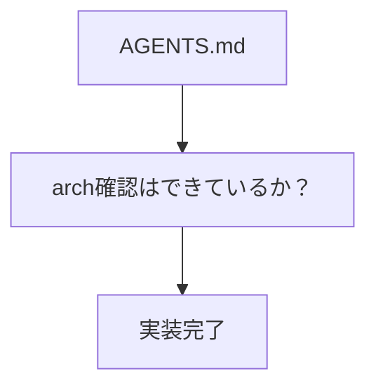
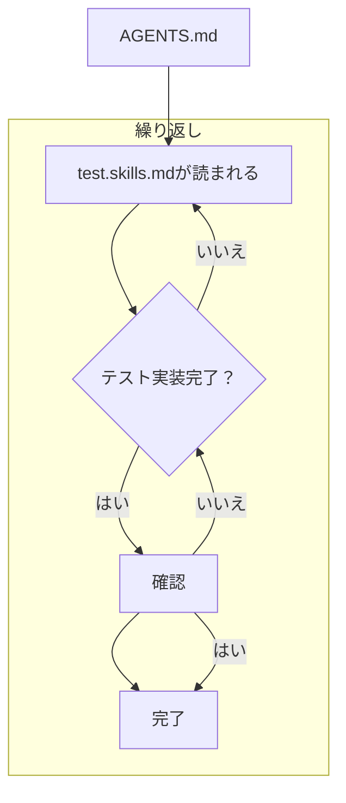

# AIを用いた開発について記載する。

## 誰に対して記載しているか

- 実装者

## ここで記載したいことを箇条書きで記載する。

- 全体のワークフロー

①Agents.md
毎回、自動で読まれるもの。
ここに記載するのは
そもそもAI駆動開発で使用するものがわからないかな。
skills
arch.md
実装のmd
review.md

## それぞれのファイルについて

- AGENTS.md

instrusction_arch.mdみたいなものを想定している。

## 実行手順

1. AGENTS.mdが毎回読み込まれる
2. arch.mdが読まれてarchの全体像が理解される。
3. bloc.mdみたいなものが呼ばれて実装される。
4. test.mdでテスト実装される
5. E2Eテスト

## 新規開発手順

①AGENTS.mdが毎回読まれる。
②testSkillsが読まれる。
