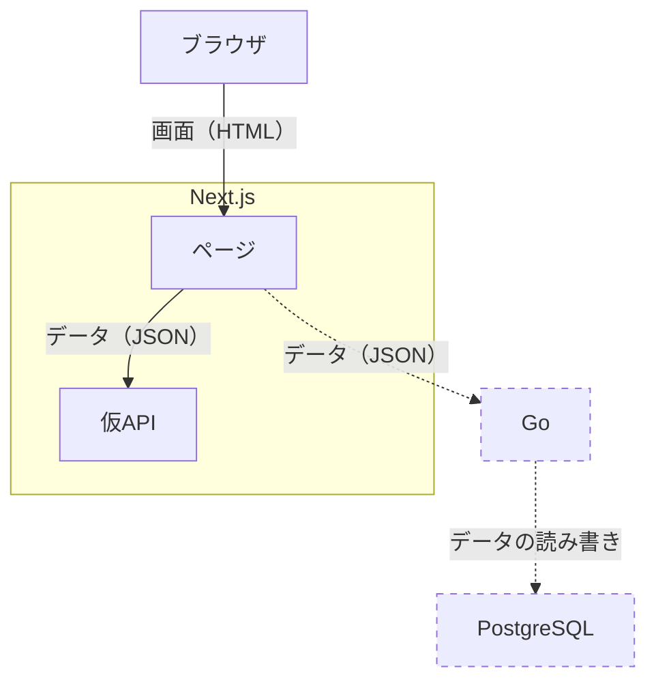

# アーキテクチャ

状態：合意済み

## 目的

このプロジェクトのアーキテクチャの全体を示す。

## ブロック図

```mermaid
flowchart TD
A[ブラウザ] -->|画面（HTML）| B[ページ]
B -->|データ（JSON）| C[仮API]
B -.->|データ（JSON）| D[Go]
D -.->|データの読み書き| E[PostgreSQL]


subgraph Next.js
B
C
end

classDef future stroke-dasharray: 5 5
class D future
class E future
```

点線はフェーズ2以降に作るもの
