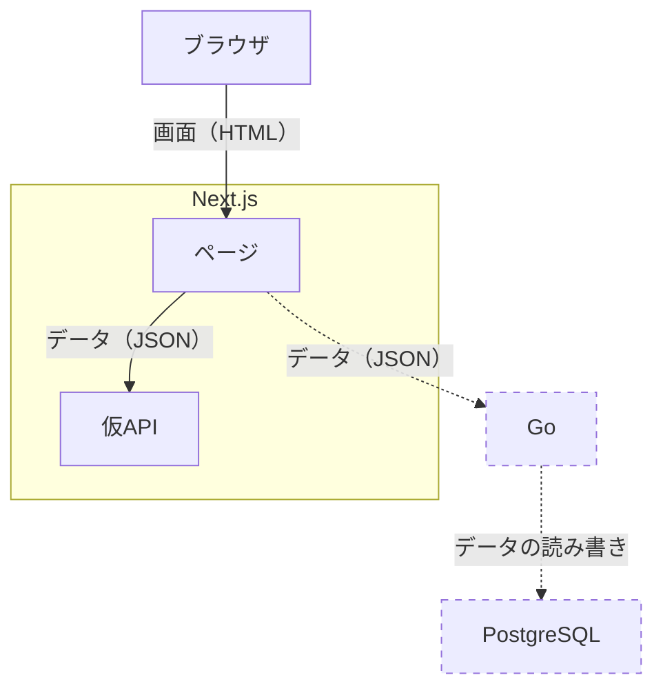
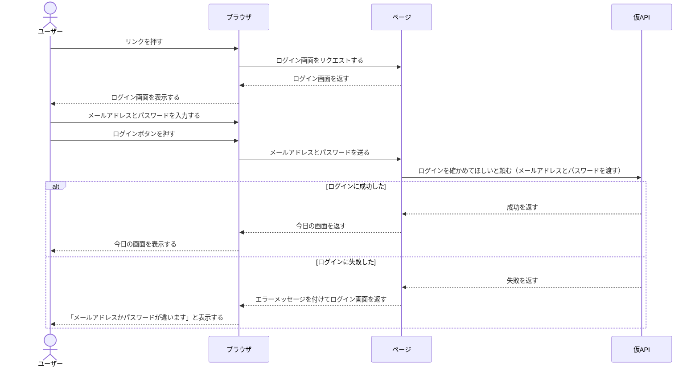

# アーキテクチャ

## 目的

このプロジェクトのアーキテクチャの全体を示す。

## ブロック図

状態：合意済み

```mermaid
flowchart TD
A[ブラウザ] -->|画面（HTML）| B[ページ]
B -->|データ（JSON）| C[仮API]
B -.->|データ（JSON）| D[Go]
D -.->|データの読み書き| E[PostgreSQL]


subgraph Next.js
B
C
end

classDef future stroke-dasharray: 5 5
class D future
class E future
```

点線はフェーズ2以降に作るもの

## シーケンス図

状態：下書き

```mermaid
sequenceDiagram
   actor ユーザー
   participant ブラウザ
   participant ページ
   participant 仮API
   ユーザー->>ブラウザ: リンクを押す
   ブラウザ->>ページ: ログイン画面をリクエストする
   ページ-->>ブラウザ: ログイン画面を返す
   ブラウザ-->>ユーザー: ログイン画面を表示する
   ユーザー->>ブラウザ: メールアドレスとパスワードを入力する
   ユーザー->>ブラウザ: ログインボタンを押す
   ブラウザ->>ページ: メールアドレスとパスワードを送る
   ページ->>仮API: ログインを確かめてほしいと頼む（メールアドレスとパスワードを渡す）
   alt ログインに成功した
      仮API-->>ページ: 成功を返す
      ページ-->>ブラウザ: 今日の画面を返す
      ブラウザ-->>ユーザー: 今日の画面を表示する
   else ログインに失敗した
      仮API-->>ページ: 失敗を返す
      ページ-->>ブラウザ: エラーメッセージを付けてログイン画面を返す
      ブラウザ-->>ユーザー: 「メールアドレスかパスワードが違います」と表示する
   end
```
