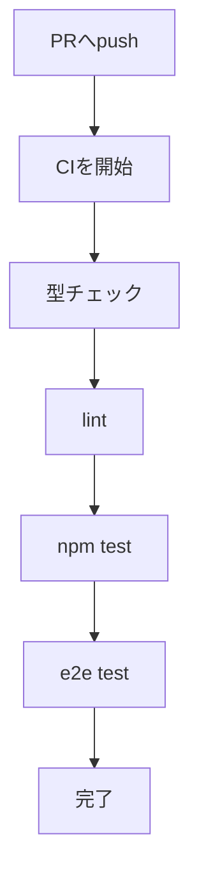
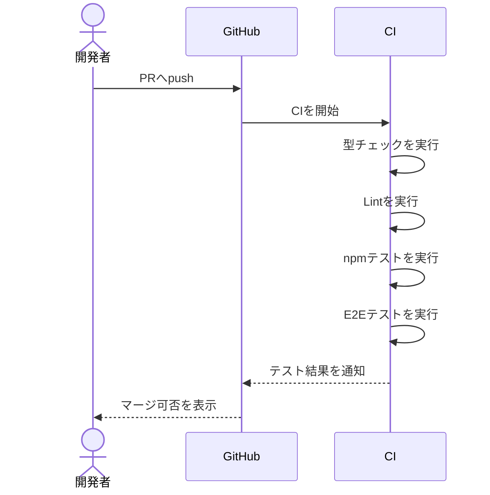

# CIの設計

## 目的

マージ前にテストが成功していることを確認する。

## 実行タイミング

`main`ブランチに対するPRが作成・更新された時。

## 実行するテスト

1. 型チェック
2. lint
3. `npm test`
4. E2Eテスト

```mermaid
flowchart TD
  A[PRへpush] --> B[CIを開始]
  B --> C[型チェック]
  C --> D[lint]
  D --> E[npm test]
  E --> F[e2e test]
  F --> G[完了]
```

## 処理の流れ

```mermaid
sequenceDiagram
   actor 開発者
   participant GitHub
   participant CI

   開発者->>GitHub: PRへpush
   GitHub->>CI: CIを開始
   CI->>CI: 型チェックを実行
   CI->>CI: Lintを実行
   CI->>CI: npmテストを実行
   CI->>CI: E2Eテストを実行
   CI-->>GitHub: テスト結果を通知
   GitHub-->>開発者: マージ可否を表示
```
