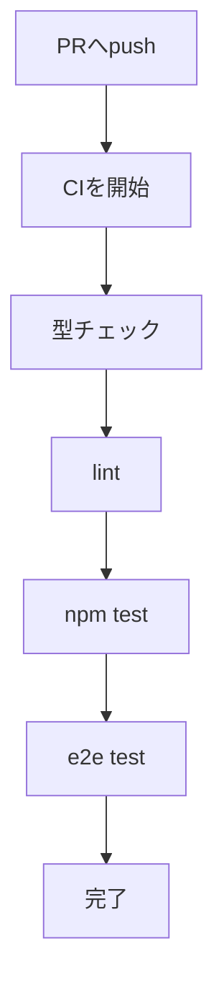
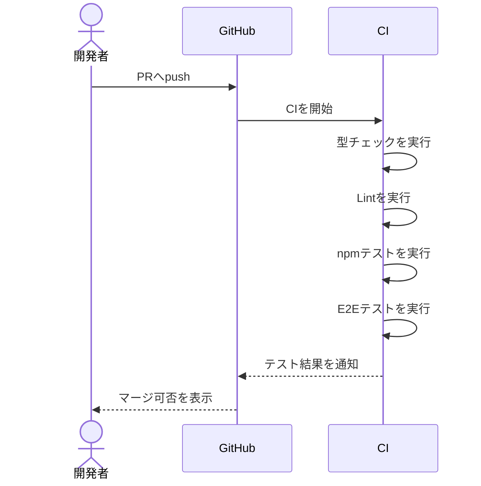
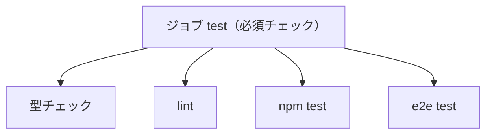

# CIの設計

## 目的

マージ前にテストが成功していることを確認する。

## 実行タイミング

`main`ブランチに対するPRが作成・更新された時。

## 実行するテスト

1. 型チェック
2. lint
3. `npm test`
4. E2Eテスト

## 処理の流れ

## マージの条件

`main`はRuleset（`protect-main`）で守っている。古い「ブランチ保護」ではないので、設定はリポジトリの Settings → Rules → Rulesets にある。

| ルール | 設定 | 意味 |
| --- | --- | --- |
| 必須チェック | `test`（GitHub Actions） | このチェックが緑でないとマージできない |
| strict | オン | `main`が先に進んでいたら、ブランチを最新にしないとマージできない |
| PR必須 | 承認0人 | `main`へ直接pushできない。1人開発なので承認は求めない |
| 削除・force pushの禁止 | オン | `main`を消したり履歴を書き換えたりできない |
| 例外（bypass） | なし | 管理者もルールを無視できない |

### 必須チェックはジョブ名を見ている

必須チェックの`test`は、`ci.yaml`の**ジョブ名**（`jobs: test:`）のこと。ステップ名ではない。
どのステップが落ちてもジョブ全体が赤になるので、型チェック・lint・テスト・E2Eはすべてマージの条件になる。

### 変更するときの注意

- **ジョブ名を変えたら、Rulesetも直す。** 直さないと必須チェックが`test`の結果を待ち続け、PRが「Expected — Waiting for status」のまま止まる
- **ジョブを分けたら、増えたジョブも必須チェックに足す。** 足さないと、そのジョブが赤でもマージできてしまう
