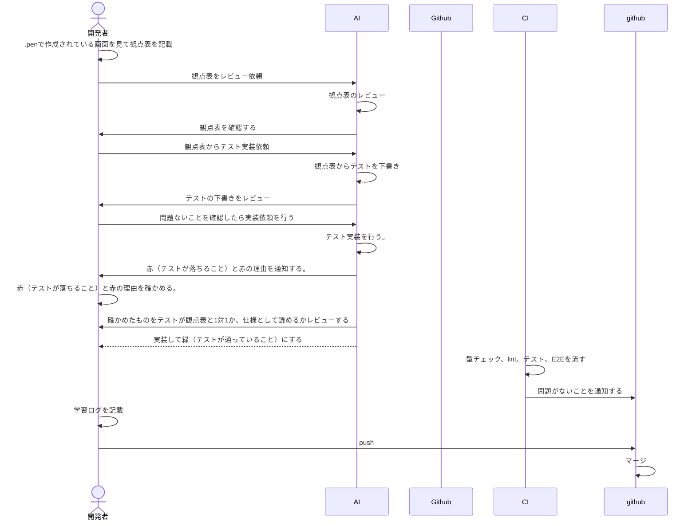

# テスト設計書

## 目次

- [テスト設計書を作る目的](#テスト設計書を作る目的)
- [列の定義](#列の定義)
- [設計から実装までの流れ](#設計から実装までの流れ)
  - [フロー図](#フロー図)
- [各画面の設計書](#各画面の設計書)
  - [ログイン画面](./login.md)

## このファイル本書の目的

実装者とレビュー者が共通認識を合わせるために作成する。

## 列の定義

- ID、観点、前提、操作、期待結果
  上記で定義している。
- ID: 「画面の接頭辞、層の記号（C/E）、2桁の連番」例）LOGIN-C01
- 観点: 「どこを見ているか？」例）見出し
- 前提: テストを始める前の状態。例）ログイン中など
- 操作: ボタンを押すなど、操作するものを記載する。
- 期待結果: 操作後の結果、どうなるか？ってことを記載する。

## テストの分け方

- コンポーネントテストとE2Eテストを分けて記載する。
  例を以下に示す。

### コンポーネントテスト

| ID     | 観点   | 前提 | 操作     | 期待結果        |
| ------ | ------ | ---- | -------- | --------------- |
| TOP-02 | 見出し | なし | 描画する | h1が1つだけある |

### E2E

| ID     | 観点       | 前提 | 操作      | 期待結果                         |
| ------ | ---------- | ---- | --------- | -------------------------------- |
| TOP-03 | キーボード | なし | Tabを押す | 最初のリンクにフォーカスが当たる |

## 設計から実装までの流れ

### フロー図

## 各画面の設計書

- [ログイン画面](./login.md)
