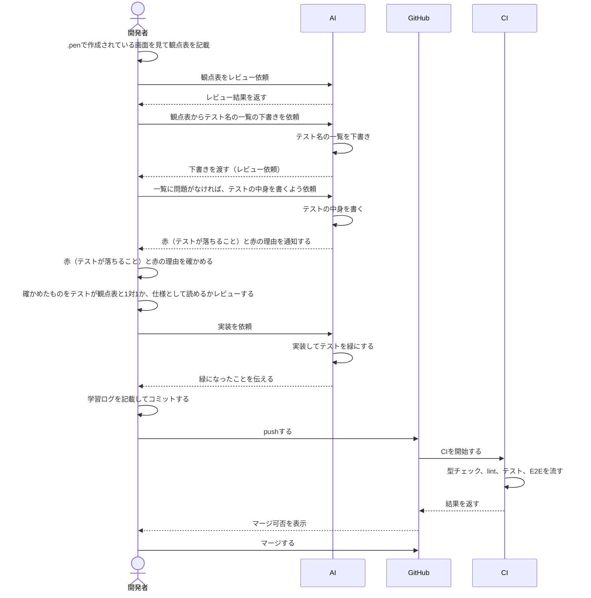

# テスト設計書

## 目次

- [本書の目的](#本書の目的)
- [列の定義](#列の定義)
- [テストの分け方](#テストの分け方)
  - [コンポーネントテスト](#コンポーネントテスト)
  - [E2E](#e2e)
- [各画面ファイルの書き方](#各画面ファイルの書き方)
- [設計から実装までの流れ](#設計から実装までの流れ)
  - [フロー図](#フロー図)
- [各画面の設計書](#各画面の設計書)
  - [ログイン画面](./login.md)

## 本書の目的

実装者、レビュー者、AI が、テストで何を確かめるかの共通認識を持つために作る。
AI はこのファイルのルールに従って、観点表からテストを書く。

## 列の定義

- ID、観点、前提、操作、期待結果
  上記で定義している。
- ID:
  - 形: `<画面の接頭辞>-<層の記号 C/E><2桁の連番>` 例: `LOGIN-C01`
  - テスト名の先頭に入れる 例: `test("LOGIN-C01 見出しが1つだけある", ...)`
  - 消したIDは使い回さない

- 観点: 「どこを見ているか？」例）見出し
- 前提: テストを始める前の状態。例）ログイン中など
- 操作: ボタンを押すなど、操作するものを記載する。
- 期待結果: テストで確かめられる具体さで書く。
  - 良い例: h1に『SelfSketch』が見える
  - 悪い例:『画面が表示される』

## テストの分け方

- コンポーネントテストとE2Eテストを分けて記載する。
  例を以下に示す。

### コンポーネントテスト

- 1画面の中の表示と操作

| ID        | 観点   | 前提 | 操作     | 期待結果        |
| --------- | ------ | ---- | -------- | --------------- |
| LOGIN-C01 | 見出し | なし | 描画する | h1が1つだけある |

### E2E

- 画面遷移を伴うものはこちらに記載すること

| ID        | 観点                         | 前提                                                         | 操作                 | 期待結果                       |
| --------- | ---------------------------- | ------------------------------------------------------------ | -------------------- | ------------------------------ |
| LOGIN-E01 | ログインに成功したときの遷移 | 登録済みのユーザーがいる。正しいメールとパスワードを入力済み | ログインボタンを押す | 今日のダッシュボードに遷移する |

## 各画面ファイルの書き方

- 1行目の読み手と目的
- コンポーネントテストの表
- E2Eテストの表

## 設計から実装までの流れ

### フロー図

## 各画面の設計書

作る画面の一覧は [learning-plan.md](../../learning-plan.md) のフェーズ 1 が元。

| 画面                         | ファイル               | IDの接頭辞 | .penのノード | 進み具合           |
| ---------------------------- | ---------------------- | ---------- | ------------ | ------------------ |
| W-Auth 1 ログイン            | [login.md](./login.md) | LOGIN      | ES2YF        | 表示のみ（書き中） |
| W-Auth 2 サインアップ        | signup.md              | SIGNUP     | wM8qs        | 未着手             |
| W-Auth 3 パスワード再設定    | password-reset.md      | RESET      | b8yrP        | 未着手             |
| W-Home 1 今日ダッシュボード  | today.md               | TODAY      | fUv9W        | 未着手             |
| W-Home 2 習慣を作成（Modal） | habit-create.md        | HABITNEW   | KOgk7        | 未着手             |
| W-Home 3 習慣詳細            | habit-detail.md        | HABIT      | QMnku        | 未着手             |
