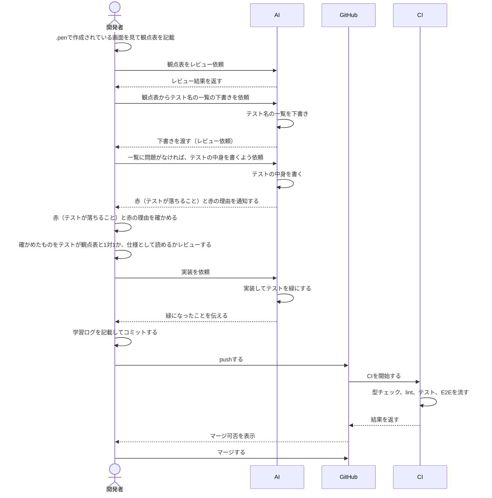

# テスト設計書

## 目次

- [このファイル本書の目的](#このファイル本書の目的)
- [列の定義](#列の定義)
- [テストの分け方](#テストの分け方)
  - [コンポーネントテスト](#コンポーネントテスト)
  - [E2E](#E2E)
- [設計から実装までの流れ](#設計から実装までの流れ)
  - [フロー図](#フロー図)
- [各画面の設計書](#各画面の設計書)
  - [ログイン画面](./login.md)

## このファイル本書の目的

実装者とレビュー者が共通認識を合わせるために作成する。

## 列の定義

- ID、観点、前提、操作、期待結果
  上記で定義している。
- ID:
  - テスト名にIDを入れる
  - 画面の接頭辞
  - 層の記号（C/E）
  - 2桁の連番
  - 消したIDは使い回さない
  - 例: LOGIN-C01

- 観点: 「どこを見ているか？」例）見出し
- 前提: テストを始める前の状態。例）ログイン中など
- 操作: ボタンを押すなど、操作するものを記載する。
- 期待結果: 操作後の結果、どうなるか？ってことを記載する。

## テストの分け方

- コンポーネントテストとE2Eテストを分けて記載する。
  例を以下に示す。

### コンポーネントテスト

- 1画面の中の表示と操作

| ID        | 観点   | 前提 | 操作     | 期待結果        |
| --------- | ------ | ---- | -------- | --------------- |
| LOGIN-C01 | 見出し | なし | 描画する | h1が1つだけある |

### E2E

- 画面遷移を伴うものはこちらに記載すること

| ID        | 観点 | 前提               | 操作                 | 期待結果                       |
| --------- | ---- | ------------------ | -------------------- | ------------------------------ |
| LOGIN-E01 | 画面 | ログイン画面にいる | ログインボタンを押す | 今日のダッシュボードに遷移する |

## 各画面ファイルの書き方

- 1行目の読み手と目的
- コンポーネントテストの表
- E2Eテストの表

## 設計から実装までの流れ

### フロー図

## 各画面の設計書

- [ログイン画面](./login.md)
