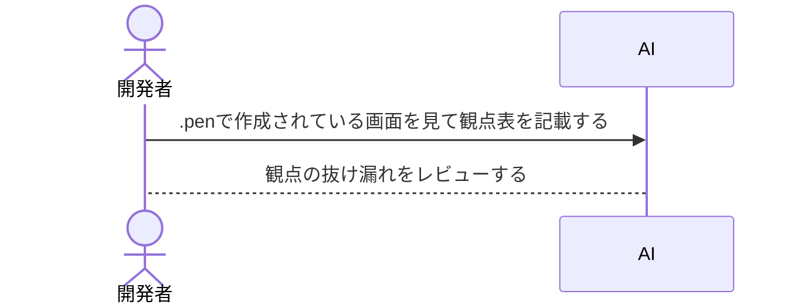

# テスト設計書

## 目次

- [テスト設計書を作る目的](#テスト設計書を作る目的)
- [列の定義](##列の定義)
- [設計から実装までの流れ](#設計から実装までの流れ)
  - [フロー図](###フロー図)
- [各画面の設計書](#各画面の設計書)
  - [ログイン画面](./login.md)

## このファイル本書の目的

実装者とレビュー者が共通認識を合わせるために作成する。

## 列の定義

- ID、観点、前提、操作、期待結果
  上記で定義している。

- ID: ここがなんて書いていいかわからない。
- 観点: 見出しなど、どこを見ているか？ってことかな？
- 前提: ここもなんて書いたらいいかわからない。
- 操作: ボタンを押すなど、操作するものを記載する。
- 期待結果: 操作後の結果、どうなるか？ってことを記載する。

## 設計から実装までの流れ

### フロー図

## 各画面の設計書

- [ログイン画面](./login.md)
